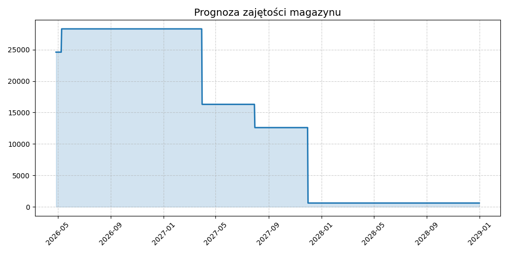

# Zarządzanie Magazynem

## Wizualizacja zajętości

### Jak używać?
1. Edytuj plik `magazyn.csv`.
2. Dodaj projekt i daty (YYYY-MM-DD).
3. Zapisz zmiany (Commit). Wykres odświeży się sam po chwili.
